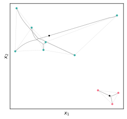

# CCMMPy

[](https://www.gnu.org/licenses/gpl-3.0)

`CCMMPy` implements convex clustering using the minimization algorithm presented in the paper _Convex Clustering through MM: An Efficient Algorithm to Perform Hierarchical Clustering_ by D.J.W. Touw, P.J.F. Groenen, and Y. Terada. For issues, please use [Github Issues](https://github.com/djwtouw/CCMMPy/issues).

There is also an [R package](https://github.com/djwtouw/CCMMR) available.

## Contents
- [Installation](#installation)
- [Examples](#examples)
	* [Example 1: Computation of a clusterpath](#example-1-computation-of-a-clusterpath)
	* [Example 2: Connectedness of the weights](#example-2-connectedness-of-the-weights)
	* [Example 3: Searching for a number of clusters](#example-3-searching-for-a-number-of-clusters)
- [Dependencies and Licenses](#dependencies-and-licenses)

## Installation
`CCMMPy` has the following dependencies:
- matplotlib
- numpy
- pandas
- pybind11
- scikit-learn
- seaborn

To install `CCMMPy`, clone the repository and open a terminal in the top level directory and run
``` bash
cd ccmmpy
pip install .
```
Another option is to install the package directly from GitHub using
``` bash
pip install "ccmmpy @ git+https://github.com/djwtouw/CCMMPy#subdirectory=ccmmpy"
```

## Examples
The code for the following examples is also present in `examples.py`. Start with the necessary imports.
```Python
import numpy as np
from ccmmpy import SparseWeights, CCMM
```
### Example 1: Computation of a clusterpath
After loading the data, a sparse weight matrix is constructed based on the `k=8` nearest neighbors. This means that nonzero weights are computed only for pairs of objects that are _k_ nearest neighbors of each other. By default, the weight matrix is constructed so that every observation is (in)directly connected to all other observations via nonzero weights. This ensures that the minimum number of clusters is one. To turn off this behavior, set `connected=False`. Finally, `phi` determines how quickly the weights decay to zero as the distance between `X[i, :]` and `X[j, :]` increases.

```Python
# Load data
X = np.genfromtxt("data/data.csv", delimiter=",")

# Generate a sparse weight matrix
W = SparseWeights(X, k=8, phi=3)
```
Next, a sequence of values for $\lambda$ is chosen for which the convex clustering loss function should be minimized.
```Python
# Set a sequence for lambda
lambdas = np.arange(0, 350, 0.1)

# Compute the clusterpath given the lambdas
clust = CCMM(X, W).convex_clusterpath(lambdas)
```
A clusterpath can be visualized in 2D with the next line of code. In this example the observations are colored based on the solution with four clusters.
```Python
# Plot the clusterpath and color the observations for the solution with four
# clusters
clust.plot_clusterpath(n_clusters=4)
```


The value for `phi` can be changed on the fly: when setting it to a new value, the weight matrix is automatically updated. The same is true for `k`, `connected`, and `connection_type`. After running the following bit of code, we can see that the clusterpath is altered slightly in comparison to the previous clusterpath that was computed with `phi=3`.
```Python
# Change phi
W.phi = 4.5

# Compute the clusterpath given the lambdas
clust = CCMM(X, W).convex_clusterpath(lambdas)

# Plot the clusterpath and color the observations for the solution with four
# clusters
clust.plot_clusterpath(n_clusters=4)
```


To get a cluster membership vector for a particular number of clusters, there must be a $\lambda$ for which that number of clusters was found. The following line will raise an exception if the requested number of clusters is not available.
```Python
# Get the cluster membership vector
labels = clust.clusters(4)

# Fails
labels = clust.clusters(93)
```

### Example 2: Connectedness of the weights
If a connected weight matrix is not enforced by calling `SparseWeights(..., connected=False)`, there is no guarantee that the clusterpath will terminate in one cluster. This is illustrated in the following example. Begin with a small randomly generated data set. This time, connectedness of the sparse weight matrix is not ensured.
```Python
# Generate a data set
np.random.seed(12)
X = np.random.rand(10, 2)

# Generate a sparse weight matrix
W = SparseWeights(X, k=2, phi=3, connected=False)

# Set a sequence for lambda
lambdas = np.arange(0, 60, 0.05)

# Compute the clusterpath given the lambdas
clust = CCMM(X, W).convex_clusterpath(lambdas)
```
In the following clusterpath the nonzero weights are drawn as dashed lines between the objects. There are two groups that are not connected, which causes the minimum number of clusters to be two.
```Python
# Plot the clusterpath and draw nonzero weights
clust.plot_clusterpath(n_clusters=2, draw_nz_weights=True)
```


A scatter plot can also be drawn, which leaves out the clusterpath trails.
```Python
# Scatter plot
clust.scatter(n_clusters=2, draw_nz_weights=True)
```


The default option is to ensure a connected weight matrix via a symmetric circulant matrix. This method connects each object $i$ with $i+1$, guaranteeing that there is a path between all objects. Setting `W.connected = True` automatically performs the required operations to obtain a connected weight matrix.
```Python
# Set connected to true, defaults to using a symmetric circulant matrix to
# ensure connectedness
W.connected = True

# Compute the clusterpath again
clust = CCMM(X, W).convex_clusterpath(lambdas)

# Plot the clusterpath and draw nonzero weights
clust.scatter(n_clusters=2, draw_nz_weights=True)
```
The clusterpath below shows which nonzero weights were added to the weight matrix. Although it may look messy at first glance, the result of this approach is comparable to the disconnected weight matrix. If the clusterpath result is queried for a solution with two clusters, the same two are returned as by the clusterpath that used the disconnected weight matrix. The main difference is that in this case, it is possible to also to ask for fewer than two clusters.


A more advanced method of adding nonzero weights involves a minimum spanning tree. At the cost of a higher computational burden, the minimum number of nonzero weights that ensures a connected weight matrix can be added. It is easy to change the method used to obtain a connected weight matrix by modifying the `connection_type` attribute. Switching back to the symmetric circulant approach can be achieved by the command `W.connection_type = "SC"`.
```Python
# Change the method to MST
W.connection_type = "MST"

# Compute the clusterpath again
clust = CCMM(X, W).convex_clusterpath(lambdas)

# Plot the clusterpath and draw nonzero weights
clust.scatter(n_clusters=2, draw_nz_weights=True)
```
Similar to the clusterpath that used the symmetric circulant matrix, the minimum spanning tree approach is also able to deliver the same two clusters as in the disconnected case while being able to reduce the number of clusters below that.


### Example 3: Searching for a number of clusters
So far, the choice for $\lambda$ has determined what the number of clusters was going to be. However, it can be difficult to guess in advance what value for $\lambda$ corresponds to a particular number of clusters. The following code looks for clusterings in a specified range. If the lower and upper bounds are equal, just a single clustering is looked for.
```Python
# Generate a data set
np.random.seed(2)
X = np.random.rand(10, 2)

# Generate a sparse weight matrix
W = SparseWeights(X, k=2, phi=3)

# Find two clusters
clust = CCMM(X, W).convex_clustering(target_low=2, target_high=2)

# Scatter plot of the result
clust.scatter(n_clusters=2)
```


Generally, this is not recommended, as convex clustering clusters observations by applying shrinkage, numerical inaccuracies may render some clusterings impossible to obtain. Adjusting the lower and upper bounds, we can search for all clusterings between one and ten.
```Python
# Find all clusterings in the range [1, 10]
clust = CCMM(X, W).convex_clustering(target_low=1, target_high=10)
```
A common way to visualize the result from a hierarchical clustering method is a dendrogram. The height at which observations is clustered is determined by $\lambda$. 
```Python
# Plot the dendrogram
clust.plot_dendrogram()
```


By default, $\lambda$ is scaled as $\ln(1+\lambda)$ (as denoted by `height_transformation="log"`), which generally improves the spacing between cluster fusions. Alternatives for `height_transformation` are `"sqrt"`, which takes the square root of $\lambda$, and `"none"`, which does not transform $\lambda$.

## Dependencies and Licenses

This project uses the Eigen C++ library for linear algebra operations, which is licensed under the [MPL2.0](https://www.mozilla.org/en-US/MPL/2.0/) license. The Eigen source files that are included in this repository can be found in the `ccmmpy/cpp/include/Eigen/` subdirectory. For more information about Eigen, including documentation and usage examples, please visit the [Eigen website](http://eigen.tuxfamily.org/).

In addition, this project is licensed under the GNU General Public License version 3 (GPLv3). The GPLv3 is a widely-used free software license that requires derivative works to be licensed under the same terms. The full text of the GPLv3 can be found in the `ccmmpy/LICENSE` file.
